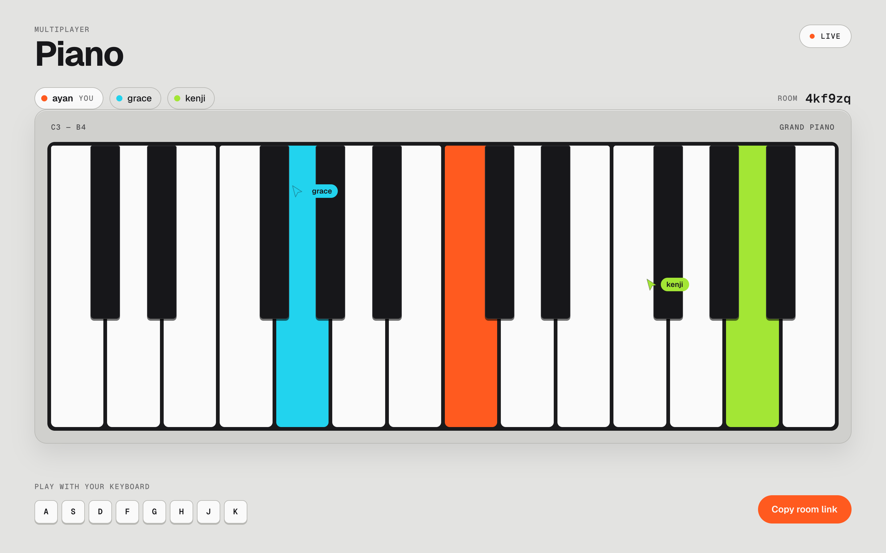

# multiplayer piano



A browser-based piano that multiple people can play together in real time,
built on Cloudflare's edge stack. Open the same room link on two devices
and you'll hear/see each other's notes land in real time.

## Stack

- **Durable Objects** — one instance per room (`PianoRoom` in `src/worker/room.ts`)
  is the single source of truth for who's connected and broadcasts every
  note event to everyone else in that room.
- **WebSocket Hibernation API** — the room uses `ctx.acceptWebSocket()`
  instead of a plain accept loop, so an idle room's Durable Object can be
  evicted from memory and only "wakes up" when a note is actually played.
  You don't pay to keep 10,000 empty rooms alive.
- **Cloudflare Vite plugin** — `vite dev` runs the Worker code inside real
  `workerd`, so local dev behaves like production instead of a Node.js
  approximation of it.
- **Web Audio API** — a real recorded piano note (`src/client/sampler.ts`)
  pitch-shifted per key, one voice per sounding note keyed by player so two
  people holding the same key are two independent voices.
- **Live cursors** — pointer positions travel as viewport fractions
  (`src/client/cursors.ts`), throttled to ~25/sec and coalesced onto
  animation frames, so they land sensibly across different screen sizes.

## Setup

```bash
npm install
npm run dev
```

Open the printed local URL, then open it again in a second browser profile
(or on your phone on the same network) to jam with yourself. You'll be asked
for a name on the way in; everyone in the room sees that name follow your
cursor. Deploying:

```bash
npx wrangler login   # first time only
npm run deploy
```

Tests drive two real browser contexts into one room:

```bash
npm test               # against the dev server
npm run test:preview   # against the production build
```

## Hosting on GitHub Pages

Pages is static hosting — it cannot run the Worker or the Durable Object, so
it can't host the multiplayer half on its own. The split that does work:

- **Worker + Durable Object** on Cloudflare (`npm run deploy`) — rooms,
  presence, cursor and note fan-out.
- **Static client** on GitHub Pages, opening its WebSocket cross-origin
  against that Worker.

`.github/workflows/pages.yml` does the Pages half on every push to `main`.
Set a repository variable `WORKER_ORIGIN` to your deployed Worker URL
(`https://multiplayer-piano.<subdomain>.workers.dev`) first — the workflow
fails fast without it, because a Pages build with no Worker origin ships a
client that tries to open a WebSocket against `github.io` and hangs forever.

Locally the same build is `PAGES_BASE=/ VITE_WORKER_ORIGIN=<url> npm run build:pages`.

Worth knowing: deploying the Worker alone already serves the client from the
same origin, no Pages involved and no cross-origin hop. The Pages setup is
only worth it if you specifically want the site on `github.io`.

## How a note travels

1. You press a key. It plays locally *immediately* (local echo) — no
   waiting on a round trip — and a `note_on` message is sent over your
   WebSocket.
2. Cloudflare routes that WebSocket to the **one** Durable Object
   instance responsible for your room (`env.PIANO_ROOMS.idFromName(roomId)`),
   no matter where in the world you or the DO happen to be.
3. The DO stamps the message with the player's color and broadcasts it to
   every *other* connected socket in the room.
4. Their clients receive it and play/light up that note in your color.

Because there's exactly one DO per room, note ordering is consistent for
everyone — nobody sees your notes arrive in a different order than anyone
else does, which matters for something musical in a way it wouldn't for,
say, a shared todo list.

## What's next / stretch goals

- **Workers AI**: seed a backing chord or suggest a scale based on what's
  currently being played, so strangers jamming together sound less random.
- **D1**: log `note_on`/`note_off` events per room/session so a good jam
  can be saved and replayed later, or turned into a shareable recording.
- **Client-side latency compensation**: measure round-trip time per
  client and use it to nudge playback timing, so distant players still
  feel "in time" with each other.

## Talking points for interviews

- Why a Durable Object and not a plain stateless Worker? — Because
  multiple clients need to agree on shared, ordered state (who's
  connected, note ordering); a stateless function can't coordinate that
  without an external database round-trip on every message.
- Why hibernation matters at scale: without it, every open room would
  keep its Durable Object (and the WebSocket connections it holds) fully
  billed and running even when nobody's playing. Hibernation is the
  difference between "fine for a demo" and "fine for 10,000 idle rooms."
- Why local echo: waiting for a server round-trip before playing your
  *own* note would make the instrument feel laggy to the person playing
  it, even though the note reaches other players near-instantly anyway.
